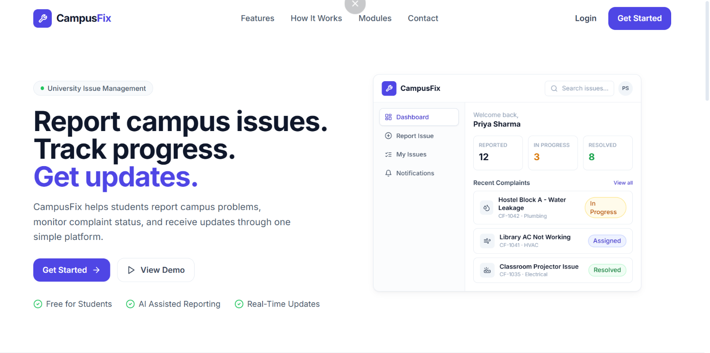
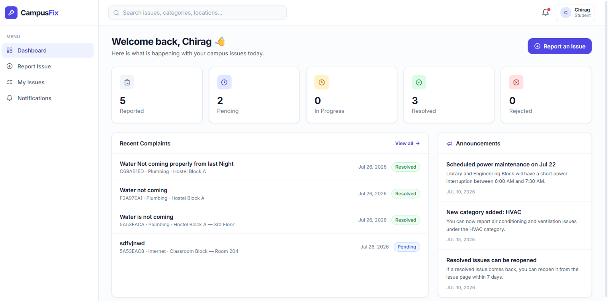
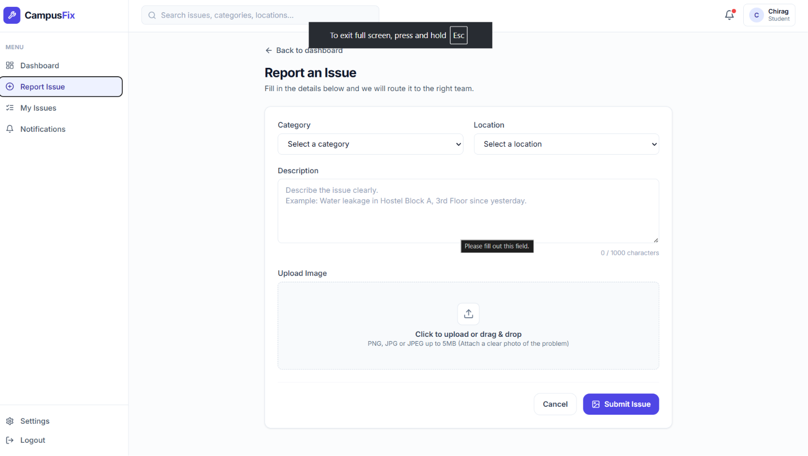
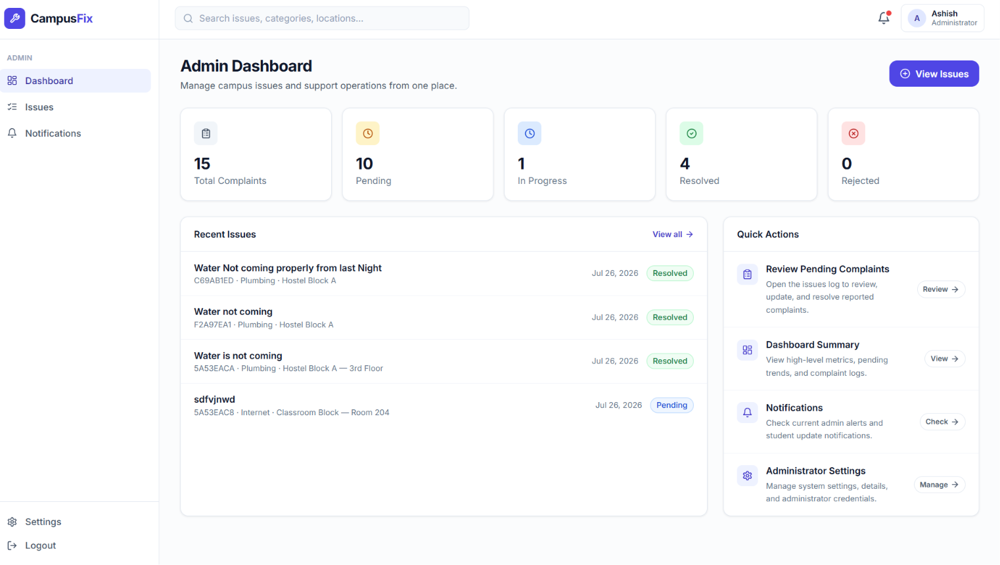

<div align="center">

# 🚀 CampusFix

### Smart Campus Complaint Management System

A full-stack **MERN** application that enables students to report campus issues digitally, track complaint progress in real time, and allows administrators to efficiently manage and resolve complaints through a centralized dashboard.

<p align="center">
  
  
  
  
  
</p>

</div>

---

# 🌟 Project Overview

CampusFix is a modern complaint management platform built for colleges and universities.

Instead of relying on manual complaint registers or verbal reporting, students can submit issues online with supporting images, monitor complaint status, and receive updates in one place.

Administrators can review, assign, update, and resolve complaints from an intuitive dashboard, improving transparency and campus maintenance.

---

# 📸 Application Preview

## 🏠 Landing Page



---

## 👨‍🎓 Student Dashboard



---

## 📝 Report an Issue



---

## 👨‍💼 Admin Dashboard



---

# ✨ Features

## 👨‍🎓 Student Module

- 🔐 Secure Registration & Login
- 📝 Report campus issues
- 📷 Upload complaint images
- 📍 Track complaint status
- 🔔 Receive notifications
- 📋 View complaint history
- 📊 Dashboard with complaint statistics

---

## 👨‍💼 Admin Module

- 🔐 Secure Admin Authentication
- 📊 Dashboard Analytics
- 📋 View all complaints
- 🔍 Filter complaints
- 🔄 Update complaint status
- 📈 Monitor complaint trends
- ⚡ Efficient complaint management

---

# 🛠 Tech Stack

## Frontend

- React.js
- Vite
- Tailwind CSS
- React Router DOM
- Axios
- Context API

## Backend

- Node.js
- Express.js
- MongoDB Atlas
- JWT Authentication
- Bcrypt
- Multer
- Cloudinary

## Deployment

| Service       | Platform      |
| ------------- | ------------- |
| Frontend      | Vercel        |
| Backend       | Render        |
| Database      | MongoDB Atlas |
| Image Storage | Cloudinary    |

---

# 🏗 Architecture

```
               Student / Admin
                      │
                      ▼
               React Frontend
                      │
                Axios API Calls
                      │
                      ▼
              Express REST API
                      │
      JWT Authentication & Authorization
                      │
          MongoDB Atlas Database
                      │
              Cloudinary Storage
```

---

# 📂 Project Structure

```
CampusFix
│
├── backend
│   ├── src
│   │   ├── config
│   │   ├── controllers
│   │   ├── middleware
│   │   ├── models
│   │   ├── routes
│   │   ├── utils
│   │   └── server.js
│   │
│   ├── package.json
│   └── .env.example
│
├── frontend
│   ├── src
│   ├── public
│   └── package.json
│
├── screenshots
│
└── README.md
```

---

# 🔐 Authentication

CampusFix uses JWT-based authentication with role-based authorization.

✔ Student Authentication

✔ Admin Authentication

✔ Password Hashing using bcrypt

✔ Protected Routes

✔ Role-Based Access Control

---

# 📷 Complaint Workflow

```
Student
    │
    ▼
Submit Complaint
    │
Upload Image
    │
Cloudinary
    │
Store Complaint
    │
MongoDB Atlas
    │
Admin Dashboard
    │
Status Update
    │
Notification
    │
Student Dashboard
```

---

# 📡 REST API

## Authentication

| Method | Endpoint             |
| ------ | -------------------- |
| POST   | `/api/auth/register` |
| POST   | `/api/auth/login`    |

---

## Issues

| Method | Endpoint          |
| ------ | ----------------- |
| GET    | `/api/issues`     |
| POST   | `/api/issues`     |
| GET    | `/api/issues/:id` |
| PATCH  | `/api/issues/:id` |

---

## Admin

| Method | Endpoint                |
| ------ | ----------------------- |
| GET    | `/api/admin/issues`     |
| PATCH  | `/api/admin/issues/:id` |

---

# 🚀 Installation

## Clone Repository

```bash
git clone https://github.com/yourusername/CampusFix.git
```

```bash
cd CampusFix
```

---

## Backend Setup

```bash
cd backend
npm install
```

Create a `.env` file.

```env
PORT=5000

MONGODB_URI=your_mongodb_uri

JWT_SECRET=your_jwt_secret

CLOUDINARY_CLOUD_NAME=your_cloud_name

CLOUDINARY_API_KEY=your_api_key

CLOUDINARY_API_SECRET=your_api_secret
```

Run Backend

```bash
npm start
```

---

## Frontend Setup

```bash
cd frontend
npm install
```

Create `.env`

```env
VITE_API_URL=http://localhost:5000/api
```

Run Frontend

```bash
npm run dev
```

---

# 🌐 Live Demo

### Frontend

> https://campus-fix-alpha.vercel.app/

### Backend API

> https://campusfix-1-6saz.onrender.com

---

# 🚀 Future Enhancements

- 🤖 AI-assisted complaint categorization
- 📧 Email notifications
- 📱 Mobile application
- 🔔 Push notifications
- 📊 Advanced analytics dashboard
- 📍 Complaint comments & discussions
- 🌍 Multi-campus support
- 📈 Performance reports

---

# 📚 Key Learnings

This project helped me gain practical experience with:

- Building scalable MERN applications
- REST API development
- JWT Authentication
- Role-Based Authorization
- MongoDB Data Modeling
- Cloudinary Integration
- Image Upload Handling
- Production Deployment using Vercel & Render
- Frontend–Backend Integration

---

# 🤝 Contributing

Contributions, suggestions, and improvements are always welcome.

1. Fork the repository
2. Create a new branch

```bash
git checkout -b feature-name
```

3. Commit your changes

```bash
git commit -m "Add feature"
```

4. Push the branch

```bash
git push origin feature-name
```

5. Open a Pull Request

---

# 📄 License

This project is licensed under the MIT License.

---

# 👨‍💻 Author

### Chirag Gupta

**B.Tech Computer Science Engineering**

💼 Aspiring Full Stack Developer

- GitHub: [Chirag Gupta](https://github.com/chiraggupta777)
- LinkedIn:[Chirag gupta](https://www.linkedin.com/in/chirag-gupta-925a93320?utm_source=share_via&utm_content=profile&utm_medium=member_ios)
- Email: guptachirag7777@gmail.com

---

<div align="center">

## ⭐ If you found this project useful, consider giving it a Star!

Made with ❤️ using the MERN Stack

</div>
